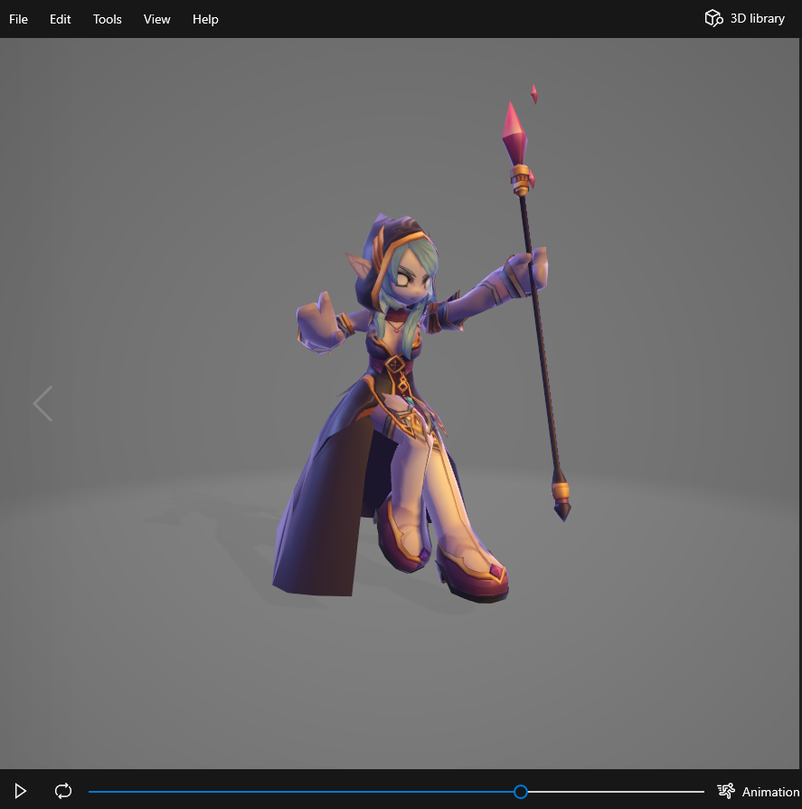
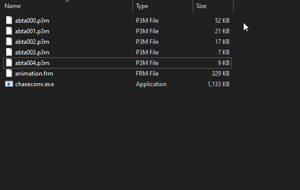

# Chaseconv

Chaseconv is a fast and simple 3D asset converter for [Grand Chase](https://en.wikipedia.org/wiki/Grand_Chase). It can convert 3D assets from the game to GLTF files and vice-versa.

## Download

You can download it on the [Releases Page](https://github.com/gabriel-dev/chaseconv/releases/latest).

## Usage

Using the program is straightforward:

1. Drag and drop the desired files onto `chaseconv.exe` (they should belong to the same model!).
2. Select the format you want to convert the files to.
3. Select the output folder.

Here's a small demonstration:

## Limitations

There are limitations, however:

### Exporting

- You can't export a standalone animation to GLTF. You can only export animations alongside models because joint data is stored inside P3M files.
- Some animations may lose data when being exported. That's because some models have fewer joints than their animations. So the extra animation channels end up being discarded.

### Importing

Importing GLTF files actually doesn't work well unless they were exported by Chaseconv. But you're invited to add support for external files yourself.

## Contributing

- Found a bug? Please file an issue describing the problem.

- Want a new feature? Feel free to leave a pull request. Some opportunities for new features are:
  - Support importing externally generated GLTF files (e.g. models and animations from Blender).
  - Add a command-line interface (CLI) to make mass-exporting files feasible.
  - Add support for other data formats (COLLADA, OBJ, etc.).
